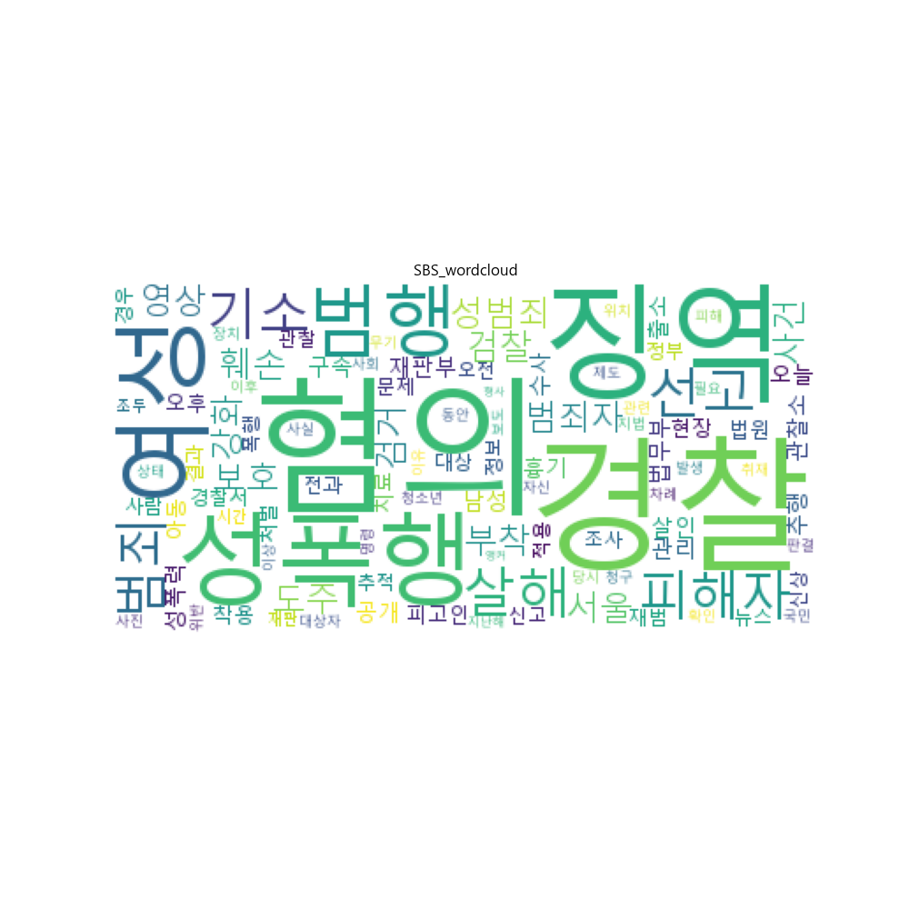
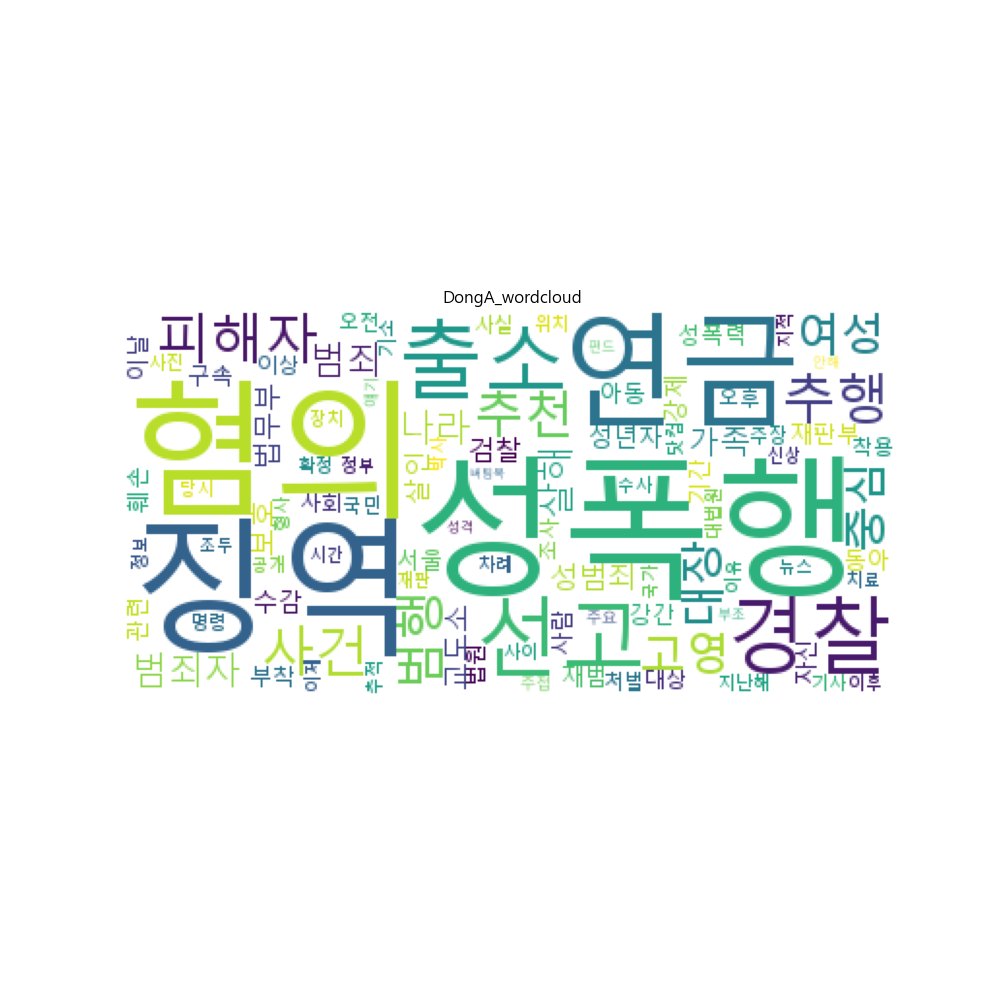

# P4DS_Capstone_Team4
<b>파이썬을 이용한 데이터사이언스(P4DS)</b> 캡스톤디자인 실습 4팀 공개 레포지토리

## members
- 데이터사이언스학과 21학번 김서연
- 데이터사이언스학과 21학번 엄채린
- 경영학과 20학번 김나연
********
## 캡스톤디자인I 주제
### 전자발찌는 정말 효과적인 성범죄자 재범 방지 도구인가? 
<!-- 중범죄를 저지른 범죄자를 전자감독하기 위해 고안된 전자발찌가 있음에도 여성을 대상으로 한 성범죄 재범은 매년 꾸준히 발생하였음. 따라서, 전자발찌가 정말 효용이 있는지에 대한 주제로 캡스톤디자인I을 진행하였음. -->

## 수집한 데이터
### 공공데이터
1. 연도별 성범죄 발생건수.csv
    - features: 연도(2000 ~ 2020), 강간 강제 추행, 카메라 등 이용 촬영, 통신매체이용 음란, 성적목적 공공장소 침입, 성폭력 범죄(합계) 
    - size: 6 * 22

2. 연도별 성폭력 전자감독대상자 수.csv
    - features: 연도(2008 ~ 2020), 총인원, 연도말 현재원
    - size: 3 * 14

3. 연도별 성폭력 전자감독대상자 중 재범건수(범죄유형별).csv
    - features: 연도(2008 ~ 2020), 재범건수, 성폭력, 살인, 강도, 미성년자 유괴, 기타
    - size: 7 * 14

### 크롤링 데이터
- '전자발찌' 키워드가 포함된 뉴스 기사
- SBS, 동아일보
- 2008.09.29(전자발찌 시행일) ~ 2021.10.31

1. SBS_data_2.json / DongA_data_2.json
    - 기사 제목(title), 주소(url), 업로드일(date), 본문(txt)
    - 중복기사 삭제 및 본문 클리닝 후 데이터

2. SBS_data_keyword.json / DongA_data_keyword.json
    - 기사 제목(title), 주소(url), 업로드일(date), 본문(txt), 키워드(keyword)
    - konlpy 패키지 내 pos() 함수를 통해 본문에서 사용된 명사와 명사 등장 빈도를 추출한 데이터(전자발찌 등 중복 키워드 제외)

3. SBS_data_3_.json / DongA_data_3.json
    - 기사 제목(title), 주소(url), 업로드일(date), 본문(txt), 상위 10개 키워드(top10_word)
    - 추출한 명사 등장 빈도에 TF-IDF(한국어 전처리 패키지)를 통해 본문 내 등장 단어(명사)의 등장 빈도에 따른 중요도를 추출하고, 상위 10개를 남긴 데이터.

## 실습 진행 방향
1. 지난 캡스톤디자인I에서는 데이터에 대한 시각화를 엑셀을 활용하여 간단히 진행하였음.
.jpg)
.jpg)
2. 파이썬을 이용한 데이터사이언스 수업에서 공부한 시각화 라이브러리를 이용하여 보다 발전되고, 퀄리티 높은 시각화 자료를 만들어 내고자 함. 
    1. 전처리까지만 진행했던 크롤링 데이터(SBS_data_3_.json/DongA_data_3_.json)를 활용해 등장 빈도가 높은 중요 키워드를 워드클라우드를 통해 시각화.
    2. 연도별 성폭력 전자감독대상자 수.csv와 연도별 성폭력 전자감독대상자 중 재범건수(범죄유형별).csv 두가지 데이터를 합쳐 bar chart 그리기

## 실습 진행 과정
### 1. 워드클라우드
크롤링한 데이터(SBS_data_3_.json / DongA_data_3_.json) 중, 뉴스 기사별 중요도 상위 10개 단어를 추출한 데이터를 활용하여 워드클라우드 제작을 진행하였다. 이에 관한 코드는 keyword_wordcloud.py 에 포함되어 있다.

1. 기사별 중요도 상위 10개 데이터가 있는 json 데이터를 입력받아 뉴스 별 키워드를 카운트하여 딕셔너리 변수로 반환하는 함수를 구현했다. (라이브러리 임포트 코드 생략)
    ```
    ## 언론사(SBS, 동아일보) 별 뉴스 별 상위 10 키워드 등장 횟수 카운트
    def getKeywordCount(file_path) :
        with open(file_path, encoding='utf-8') as file:
            data = json.load(file)[1]['news']   # 수집 데이터에서 뉴스 데이터만 추출
            keyword = dict()    # 키워드 카운트할 딕셔너리 변수
            
            for n in data :     # 뉴스 별로 반복
                for k in n['top10_word'].keys() :   # 뉴스 데이터 속 상위 10개 단어 별로 반복
                    # 키워드 카운트 변수에 개수 세기
                    if k in keyword.keys() : keyword[k] += 1    
                    else : keyword[k] = 1

        return keyword  # 카운트 결과 반환
    ```

2. 앞서 카운트한 데이터를 통해 워드클라우드를 그리고, 결과를 저장하는 함수를 구현했다. (라이브러리 임포트 코드 생략)
    ```
    ## 딕셔너리 데이터를 받아 워드클라우드 생성
    def wordcloudFromDict(data, news_office, out_file_path) :   # 데이터, 뉴스 명, 워드클라우드 저장할 파일 경로
        wc = WordCloud(font_path = font_path,     # 폰트 경로 설정
                    relative_scaling=0.2,         # 크기 조절
                    background_color='white',     # 배경색
                    ).generate_from_frequencies(data)   # 데이터 설정

        plt.figure(figsize=(10,10))    # plot 크기 설정
        plt.imshow(wc)                 # show할 wc 설정
        plt.axis('off')                # axis 삭제

        # plot title 설정
        title = news_office + '_wordcloud'
        plt.title(title)

        plt.savefig(out_file_path + title + '.png') # plot 이미지 파일로 저장

        return None</code></pre>
    ```
3. 실행 코드(visualization_wordcloud.py)를 통해 아래와 같이 SBS 기사에 대한 워드클라우드와 동아일보 기사에 대한 워드클라우드를 추출하였다.<br><br>
    SBS 워드클라우드
    
    동아일보 워드클라우드
    

### 2. 연도별 성폭력 전자감독대상자 수.csv와 연도별 성폭력 전자감독대상자 중 재범건수(범죄유형별).csv에서 성폭력만 같이 가져와서(두가지 데이터 합치기) bar chart 그리기(연도별 전자감독 대상자 중, 재범한 비율을 한 눈에 볼 수 있는 그런 그래프) -> 연도, 성폭력 전자발찌 착용자 수, 재범 수

1. 폰트 깨지는 것을 방지하기 위한 코드를 작성하고, pandas를 사용해 '연도별 성폭력 전자감독대상자 재범건수.csv'파일을 불러온다.(라이브러리 임포트 코드 생략)
 ```
font_path = "C:/Windows/Fonts/malgun.ttf"  # 폰트 깨짐 방지위한 폰트 경로 지정 및 설정
font = font_manager.FontProperties(fname=font_path).get_name()
rc('font', family=font)

df1 = pd.read_csv("../../source/preprocessedData/연도별 성폭력 전자감독대상자 재범건수.csv", encoding='utf-8') #csv파일 불러오기, 한글 깨짐을 방지하기 위해 'utf-8'을 사용하여 인코딩
 ```

2.bar chart 구현을 위한 그래프 사이즈, 막대 굵기, 위치를 설정하였다. 또한 plt 함수를 사용하여 막대의 위치, 해당 값, 막대 색깔, 라벨을 설정하여 bar chart를 그렸다. 막대는 0.25의 간격을 두고 그려진다.(라이브러리 임포트 코드 생략)
 ```
fig, ax = plt.subplots(figsize=(12, 6)) # 그래프 사이즈 설정
w = 0.25 # 막대 넓이 설정


index = np.arange(13) # 연도가 13개이므(2008~2020)로 0, 1 ... , 13 위치를 기준으로 삼음

# 각 연도별로 3개 샵의 bar를 순서대로 나타내는 과정(b1, b2, b3 동일)
b1 = plt.bar(index - w, df1['총인원'], width = w,  color='red', label='총인원') 
b2 = plt.bar(index, df1['전체재범건수'], width = w, color='blue', label='전체재범건수')
b3 = plt.bar(index + w, df1['성폭력재범건수'], width = w, color='green', label='성폭력재범건수')
 ```
 
3. 실행 코드(RecidivismPlot_run.py)를 사용하여 bar chart의 눈금을 형성하고 범례 지정 후 bar chart를 형성하였다.
 ```
plt.xticks(index, df1['연도']) # 그래프의 눈금 설정
plt.legend() # 그래프 범례 설정
plt.savefig('../../plot/성폭력 전자감독대상자 재범 분포.png') # plot 이미지 파일로 저장
plt.show() #그래프 그리기
 ```
 성폭력 전자감독대상자 재범 분포


